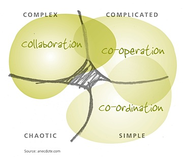

Using the Cynefin framework, which I've also [discussed here](http://blog.gbrettmiller.com/the-cynefin-framework-and-the-global-economic-crisis/), Shawn at the Anecdote blog takes a look at the question of [When should we collaborate?](http://www.anecdote.com.au/archives/2008/12/when_should_we.html) It's always useful to define your terms before starting this kind of discussion, and Shawn obliges with the following:

> So what is collaboration then? It’s when a group of people come together, driven by mutual self–interest, to constructively explore new possibilities and create something that they couldn’t do on their own.

Turns out the best time to collaborate is in a complex situation, as opposed to a complicated (cooperation) or simple (coordination) situation, as shown in Shawn's diagram below.  Of course, the diagram also shows that there is potential overlap between the quadrants, and you really do need to look at each situation individually.

