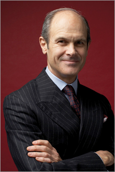

Though perhaps a bit more rigorous in his approach, what [Geoff Colvin](http://www.geoffcolvin.com/) has to say about deliberate practice in [Talent Is Overrated: What Really Separates World-Class Performers from Everybody Else](http://www.amazon.com/gp/product/1591842247?ie=UTF8&tag=gbrettmiller-20&linkCode=as2&camp=1789&creative=9325&creativeASIN=1591842247) is not unlike what George Leonard says about "practice" in [Mastery](http://www.amazon.com/gp/product/0452267560?ie=UTF8&tag=gbrettmiller-20&linkCode=as2&camp=1789&creative=9325&creativeASIN=0452267560) or how [Josh Waitzkin](http://www.joshwaitzkin.com/) describes his process of mastering chess and T'ai Ch'i in his recent book [The Art of Learning: An Inner Journey to Optimal Performance](http://www.amazon.com/gp/product/0743277465?ie=UTF8&tag=gbrettmiller-20&linkCode=as2&camp=1789&creative=9325&creativeASIN=0743277465).  What caught my eye about Colvin's book, and the main reason I read it, is its relating of this idea of deliberate practice and high performance to the world of business.

Early on in Chapter 7, Colvin highlights an issue that I've wrestled with in my mind for many years:

> We saw earlier how hostile to the principles of well-structured deliberate practice most companies seem.  That's all the more puzzling when you consider how many high-profile organizations apart from businesses embrace these principles.  We're awed by the performance of champion sports team or great orchestras and theater companies, but when we get to the office, it occurs to practically no one that we might  have something to learn by studying how some people became so accomplished.  The U.S. military has made itself far more effective by studying and adopting these principles....  But at most companies - as well as most educational institutions and many nonprofit organizations - the fundamentals of great performance are mainly unrecognized or ignored.

The reference to the military really struck home with me, since over half of my professional life (so far) was spent as an officer in the Army.  To simply say that the Army engages in "deliberate practice" - at both the individual and organizational levels - would be a gross understatement.  In fact, in a peacetime Army the primary activity of soldiers and units is deliberate practice, with the explicit goal of continually improved performance.  (More on a wartime military in a bit.)

When I left the military and joined the corporate world, what struck me most was how little practicing - and how little learning and improving - anyone did.  For anything.  The general impression was that if you needed to "practice", then you obviously were the wrong person for the job.  (This is the "hostility" to the principles of deliberate practice that Colvin refers to in the quote above.)  Needless to say, in the areas where I had influence I did my best to change that perception.

The problem is, as the title of this post hints at, that you can't get better at something by just doing that something.  The early part of **Talent is Overrated** is full of examples:  Jerry Rice didn't become the greatest football player ever by playing football games; Tiger Woods didn't become the greatest golfer by simply playing endless rounds of golf; and Benjamin Franklin didn't become the incredible writer that he was by writing essays.  All of these people, and many more, became incredibly good at what they do (did) through deliberate practice.

One of the biggest challenges for a wartime military is how to balance the need and desire for deliberate practice and continued improvement with the day-to-day operational requirements of carrying out its missions.  Having spent a few years now in the civilian world of business, I've come to realize that the "operational environment" of most organizations is much like that of a wartime military - there is such a strong focus on meeting day to day mission requirements that it is a challenge to find the time for individuals and teams to engage in deliberate practice to improve their ability to perform.

Colvin finishes with some thoughts on how organizations can apply the principles he addresses in the book for both individuals and teams.  And he believes, and I think shows throughout the book, that any organization, any individual, has the ability to become great at what they do if they are willing to put in the work.

