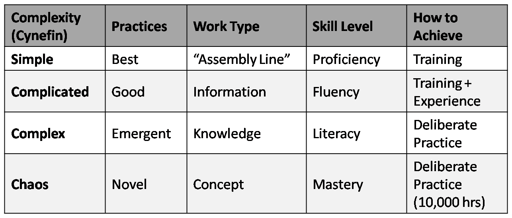

Over the past week or so there have been several blogs that have helped me pull together a bunch of things I've been trying to connect in my mind for a while.

First was [Harold Jarche'](http://www.jarche.com/)s post [Working Together](http://www.jarche.com/2009/05/working-together/), in which he looked at [Shawn Callahan's ideas](http://www.anecdote.com.au/archives/2008/12/when_should_we.html) on group work against the backdrop of [Tom Haskins discussion](http://growchangelearn.blogspot.com/2009/05/combined-models-for-pattern-recognition.html) of the [Cynefin](http://en.wikipedia.org/wiki/Cynefin) and [TIMN](http://twotheories.blogspot.com/2009/02/overview-of-social-evolution-past.html) frameworks. Next was [Tony Karrer](http://elearningtech.blogspot.com/2009/06/does-deliberative-practice-lead-to.html) and [Ken Allan](http://newmiddle-earth.blogspot.com/2009/06/proficiency-and-deliberative-practice.html)'s discussion of the role of [deliberate practice](http://money.cnn.com/magazines/fortune/fortune_archive/2006/10/30/8391794/index.htm) in the development of skills less than that of an expert, based on Tony's question:

> Any thoughts on how deliberative practice relates to becoming something less than an expert.  It seems it should be applicable to all levels of achievement, but everything I'm reading is the study of becoming an expert.  Is that just aspirational, or is deliberative practice also studied for quick attainment of proficiency?

Read Tony and Ken's posts, along with the comments, for all the discussion including my comment:

> ...the application of deliberate practice is not the most efficient way to achieve basic proficiency, even though it would be effective. As proficiency turns into literacy and then mastery, I think that deliberate practice becomes not just the most effective way but the most efficient as well.

After some thought, and several pages of scribbles, scratches, and doodles in my notebook, I put together the following table that pulls together several different topics using Cynefin as a guide.

The first two columns come directly from the definition of the [Cynefin framework](http://en.wikipedia.org/wiki/Cynefin). I had just a bit of trouble in the third column, primarily in trying to figure out what the best term would be to carry out "simple" work tasks.  I'm not completely happy with the term "assembly line", but I think it gets the idea across. I am open to any suggestions to improve this.

I was also not quite sure about the use of the terms in the "Skill Level" column, specifically the order of "fluency" and "literacy".  Again, I'm interested to hear your thoughts on this.

The heart of the table, especially as it applies to the original question that Tony asked, is the column "How to Achieve".  Various levels of deliberate practice could have been included in each row, but in looking at each level of complexity as a stand-alone level it seems to me for the "simple" and "complicated" tasks that deliberate practice, at least as defined by Geoff Colvin in "[Secrets of Greatness](http://money.cnn.com/magazines/fortune/fortune_archive/2006/10/30/8391794/index.htm)" and the more in-depth [Talent is Overrated](http://www.amazon.com/gp/product/1591842247?ie=UTF8&tag=gbrettmiller-20&link_code=as3&camp=211189&creative=373489&creativeASIN=1591842247), is overkill. And probably an unreasonable expectation to have of people who just want to do their job and go home, which is more typical of those performing this type of work.

It is once you move into the area of complex and chaotic work that the benefits gained from deliberate practice are needed, in fact necessary.  Not only must you be able to apply what is already known in ways that have already been identified, you need to be able to learn new things and figure out how to apply them in new ways. That is the nature of mastery, and the ultimate result of deliberate practice.

