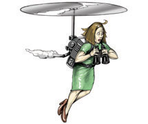

Every now and then someone will write an article - or a comment on an article - that pins the cause of autism on "overprotective" parents. These parents - also known as "[helicopter parents](http://en.wikipedia.org/wiki/Helicopter_parent)" - are so involved in their kids lives, the argument goes, that they warp them into being autistic. (Almost the opposite of the old "[refrigerator mother](http://en.wikipedia.org/wiki/Refrigerator_mother)" theory, since this new "cause" is the result of too much - not too little - love and affection.)

Before I go any further here, let me say emphatically and without qualification that I don't believe helicopter parents - or any parent, for that matter - can cause autism by spending too much (or too little) time and attention on their kids.

I do think, however, that helicopter parents may play a potentially significant role in the ever increasing number of autism diagnoses.  Consider this definition of helicopter parents from [wikipedia](http://en.wikipedia.org):

> **Helicopter parent** is a colloquial, early 21st-century term for a parent who pays extremely close attention to his or her child's or children's experiences and problems, particularly at educational institutions.... Helicopters parents are so named because, like [helicopters](http://en.wikipedia.org/wiki/Helicopter "Helicopter"), they hover closely overhead, rarely out of reach, whether their children need them or not.

Who better to recognize early signs of autism and bring them to the attention of a doctor for evaluation. So in addition to "increased awareness of autism" as a possible reason for the increased number of diagnoses, we should also consider that "increased awareness of your child" might be contributing to the number of people who have their children evaluated. Which in turn will lead to a higher number of diagnoses.

The interesting thing here, at least to me, is that once a child is diagnosed as autistic the natural tendency of parents, especially those who are already "helicopter parents", is to become even more involved in their kids lives, to become more overprotective. The nature and structure of our society, especially our education system, builds on this natural tendency to make it for all intents and purposes a necessity.

The challenge for parents is to figure out how to remain involved, as an advocate, in their child's life without trying to live their child's life for them. They need to figure out how to evolve, over time, from being a helicopter parent to a young child to being a [slow-parent](http://en.wikipedia.org/wiki/Slow_parenting) to a young adult.

If only it were as easy to do as to say.
