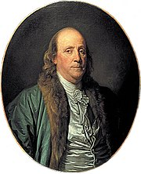

In the summer of 2007  I had the opportunity to ask [Dr. Blaine McCormick](http://www.baylor.edu/christianleadership/index.php?id=36965 "Baylor University:  Blaine McCormick"), author of [Ben Franklin: America’s Original Entrepreneur](http://www.shelfari.com/books/24186/Ben-Franklin "Shelfari.com:  Ben Franklin"), what he thought Franklin would make of the internet, social networking software, and blogs. McCormick’s response was along the lines of, “Franklin probably wouldn’t pay much attention to them, blogs are not up to the right standard.”

At the time, I didn't agree with McCormick’s assessment. Today, I disagree even more and would love the opportunity to ask him the question again. I think Franklin would have embraced blogging - all social media for that matter. I think that McCormick's response came, at least partially, from an ignorance on his part of what blogs and other social media tools are and what they are capable of. I have the feeling he also confused the sometimes dismal quality of personal blogs, etc and the potential of the tools themselves. (Remember, having good [tools do not the master make](http://blog.gbrettmiller.com/tools-do-not-a-master-or-failure-make/).)

In the hands of Benjamin Franklin, a master of getting his message out in the media of his day, I can only imagine how the media tools of today could be used.

_I was inspired to revisit this conversation by a tweet from_ [_John Tropea_](http://libraryclips.blogsome.com) _(aka_ [_@johnt_](http://www.twitter.com/johnt)_) which pointed to_ [_Collaboration Throughout the Centuries_](http://www.sharingatwork.com/2009/05/collaboration-throughout-the-centuries-a-letter-from-a-reader/) _from last spring on the_ _[Sharing at Work](http://www.sharingatwork.com)_ _blolg._
