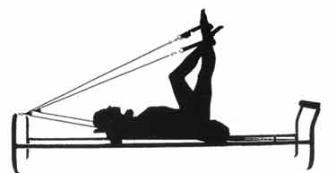

_The following descriptions are of two personal trainers who provide training to their clients using equipment and methods based on the work of_ [_Joseph Pilates_](http://en.wikipedia.org/wiki/Pilates)_._

**Trainer 1**:

Received training from one school. Her approach to training:

> This is the way I learned it, this is the way I'm teaching it to you. Don't question me, don't ask for anything. Just sit down, shut up, and do what I tell you. If you don't get anything out of this training session, it's not my fault; I'm following the training guide.

**Trainer 2**:

Actively sought training from several schools. The guidance from these different schools are often contradictory, sometimes explicitly contradictory: "That school does x, and we never ever do x." She ignores these warnings, seeing how x from one school and y from another school can work together to provide something even better. Her approach to training:

> What are you trying to achieve with this training? Is there anything you really want to do? Is their anything that you can't do or don't want to do? Let me know if something doesn't feel right or is too easy/hard. How was that workout? Next week we'll try this and see if it works better for you.

Which trainer would you rather have? Which would you go back to?
