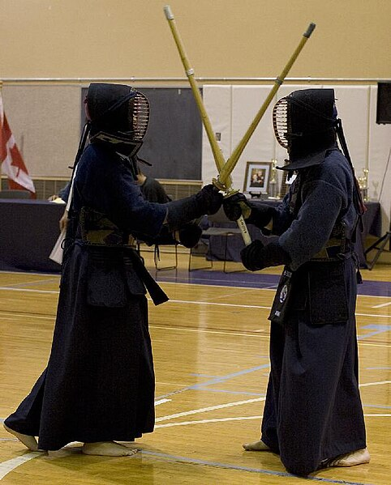

Last night I attended my first [kendo](http://en.wikipedia.org/wiki/Kendo) class. As a beginner, I felt clumsy and awkward as I tried to coordinate my footwork, proper holding of the _shinai_, and basic overhead strikes. And awed as I watched the senior members of the club do some free sparring toward the end of class. I am looking forward to continued training and learning this very cool art.

Kendo - the way of the sword - is a martial art based on _kenjutsu_, the traditional Japanese swordmanship practiced by the samurai.  As a sport, kendo obviously has taken away the lethal aspects of the art, but the spirit of the art remains. Success in kendo competition requires much the same commitment as that required by the samurai. George Leonard describes this commitment in his book [Way of Aikido, The: Life Lessons from an American Sensei](http://www.amazon.com/gp/product/0452279720?ie=UTF8&tag=gbrettmiller-20&linkCode=as2&camp=1789&creative=9325&creativeASIN=0452279720):

> Long and arduous training contributed to the samurai’s presence and clarity in combat, but there was also another key factor: The samurai had to be totally free of considerations. If, for example, he was to think, “Why didn’t I have my sword sharpened?” or “I should have settled my debt with Takeda-san,” the break in ki would be fatal. The ultimate consideration is one’s own death. For the thought “I might die” to creep into his consciousness would mean sure death. That’s why the samurai was trained from earliest childhood to go into battle with no thought of either life or death. **Being ready to die, he was more likely to live**.

Having [just read Seth Godin's Linchpin](http://blog.gbrettmiller.com/seth-godin-wants-you-to-become-a-linchpin/), I can't help seeing many parallels between the training of the samurai and what Seth is urging us to do in our own lives. For example, to be "free of considerations" is to keep the "lizard brain" at bay. Focusing on doing our work, on sharing our art, without regards to any rewards - though far from "being ready to die" - allows us to perform at out best. As Seth says in Linchpin:

> The reason you might choose to embrace the artist within you now is that this is the path to (cue the ironic music) security. When it is time for layoffs, the safest job belongs to the artist, the linchpin, the one who can't be easily outsourced or replaced.

Are you "ready to die" as you set out to change the world?
