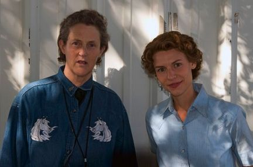

Tomorrow night HBO will premier the film [**Temple Grandin**](http://www.hbo.com/movies/temple-grandin):

> Starring Claire Danes, Julia Ormond, Catherine O'Hara, and David Strathairn **Temple Grandin** paints a picture of a young woman's perseverance and determination while struggling with the isolating challenges of autism at a time when it was still quite unknown.

 The film is based on two of Grandin's books about autism, [Emergence: Labeled Autistic](http://www.amazon.com/gp/product/0446671827?ie=UTF8&tag=gbrettmiller-20&linkCode=as2&camp=1789&creative=9325&creativeASIN=0446671827) (written with Margaret Scariano) and [Thinking in Pictures, Expanded Edition: My Life with Autism](http://www.amazon.com/gp/product/0307275655?ie=UTF8&tag=gbrettmiller-20&linkCode=as2&camp=1789&creative=9325&creativeASIN=0307275655). Given the typical Hollywood treatment of autism (Rain Man, anyone), I had my doubts - fears, maybe - about how this story would be told. A [review of the film](http://www.theatlantic.com/doc/201002u/autism-movies) in yesterday's The Atlantic has helped to alleviate those concerns:

> Stereotypical characters with autism are a convenient and powerful device for convincing neurotypical people to mend their ways, or for demonstrating the saintliness of the people who put up with them.  These cinematic conceits make HBO’s _[Temple Grandin](http://www.hbo.com/movies/temple-grandin/index.html)_, a biopic of the acclaimed animal scientist and autism advocate (to premier on HBO on February 6 at 8 p.m.), particularly remarkable.  From the life of [one of the best-known individuals with an autism spectrum disorder](http://en.wikipedia.org/wiki/Temple_Grandin), director Mick Jackson has managed to make an utterly original movie about autism, simply by allowing Grandin, portrayed in a stunning performance by Claire Danes, to be the center of her own story.

If you are at all involved in the "autism community", I know that you will probably be checking out this film. If you are not involved with, or even familiar with, autism, I encourage you to watch this film with an open mind. It may just help you understand the sentiment that those with autism are different, but not less, and are most definitely not broken.
