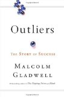

 I had been meaning to read Malcolm Gladwell's [Outliers: The Story of Success](http://www.amazon.com/gp/product/0316017922?ie=UTF8&tag=gbrettmiller-20&linkCode=as2&camp=1789&creative=9325&creativeASIN=0316017922)ever since it was first published just over a year ago. Since a lot of the discussion of the book focused on the "[10,000 hour rule](http://www.google.com/search?rlz=1C1CHMI_en-USUS291US357&sourceid=chrome&ie=UTF-8&q=10,000+hour+rule)" for achieving expertise, or mastery, it seemed a perfect fit for my interests. I'm still surprised that it took this long for me to get to it, but I have to say I'm glad that I waited. Not because I didn't enjoy it, but because I think I appreciate its message better now than I would have if I had read it a year ago.

My first impression on reading the book was along the lines of, "Wait a minute. This book isn't about mastery." True, Gladwell talks about the hard work that goes into becoming an expert in a given trade or profession, and includes this expertise as a prerequisite for achieving success. What comes out, or at least what I got out of it is: **mastery is required, but not sufficient, to achieve success**. (For the purposes of this review, I'll leave a discussion of what constitutes success to another day.) Mastery is just one part of success, according to Gladwell, the other two being opportunity - and taking advantage of it - and legacy (your cultural background).

Of course, both opportunity and legacy definitely have an impact on your ability and desire to achieve mastery in a given topic.  Gladwell goes through a wide variety of examples of real people, showing these principles in action, including:

- Bill Gates had an early interest in computers, and because of his cultural environment had the opportunity to use a nearly unlimited amount of free computer access at a time when that access was prohibitively expensive for everyone, much less a teenager.
- A study of Canadian junior hockey players showed that because of the of the structure of seasons and age cut off dates,  those born early in the year were more likely to have success. He applies this same process to Jewish lawyers in New York and other groups.
- In a chapter titled "Rice paddies and math tests", Gladwell explores how the differences in agriculture between Asia and the US have contributed to the differences in education systems and the conventional wisdom (you could say stereotype) that "Asian kids are good at math."
- And more...

I enjoyed this book. I'm not sure I learned anything new in terms of "facts", but I did come away with an understanding of a different way of looking at the stories of the people around me, successful or not. After reading the epilogue, in which Gladwell tells his family story applying the concepts in Outliers, I can't help but look at every situation now and wonder, "What's the real story behind how that person got to where they are?"

It has also encouraged me to look at my own past, to better understand my legacy and the opportunities that I've had along the way. And my future, to wonder what unique opportunity that my generation has been given and what I will have made of it when the time comes to look back on my life.
