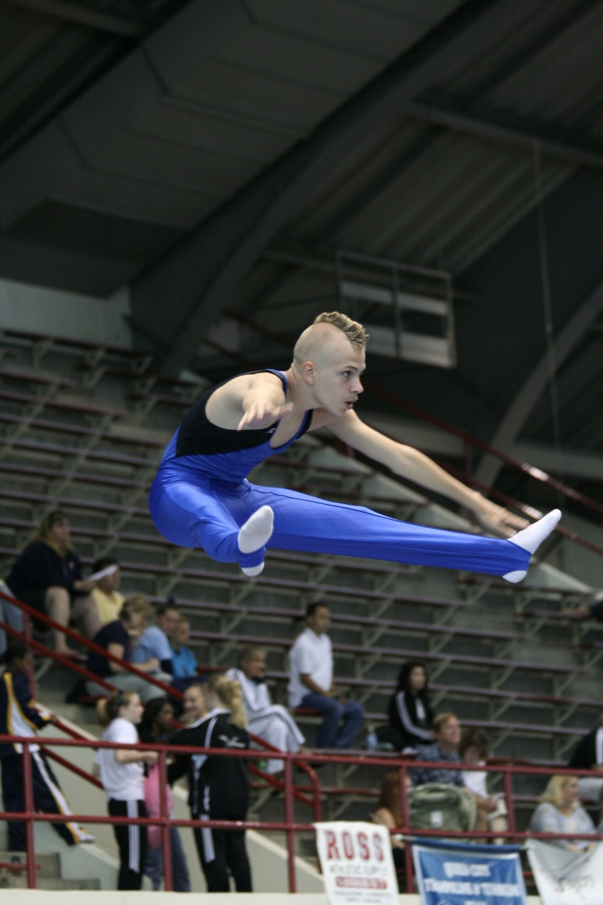

I don't remember exactly where I read this, and I'm paraphrasing a bit, but this little anecdote captures the essence of mastery, and the sacrifice that often goes with it:

> A world class, and world famous, dancer was approached by an excited fan following a performance.
> 
> "You were fantastic!" the fan said. "I'd give half my life to be able to dance like that."
> 
> "That's exactly what I did," responded the dancer.

If you are the parent of a child involved in athletics at the elite level, or an adult who was one of those kids, you know exactly what this dancer is talking about. My own personal experience as a parent is with gymnastics.

My son was (is) very talented on the trampoline (he was a national champion at his age / level), but when it came time to make the move into "elite", he recognized that he wasn't willing to make the sacrifice demanded of that level. We know plenty of others who chose to make that sacrifice.

(As an aside, there is quite the business in "online education" for those young athletes who are unable to attend school - middle, high - because of their intense training schedule.)

The hardest part of embarking on the master's journey is the knowledge of the sacrifices you must make, the things that you must give up or resign yourself to never experience. That is why I think it is so much easier for kids - or younger people - to commit themselves to that journey.

As parents, we have a responsibility to make sure that our kids have a "childhood". Many times this takes the form of making sure they are "well rounded", and don't spend too much time on any one thing. In other words, setting up roadblocks on the master's path.

How much of this is because we really think this is best for our kids, and how much of it is an expression of our own fear of the tough journey?
