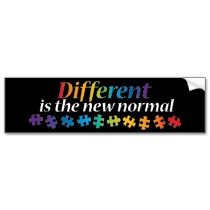

 What does it mean to be normal? What does it mean to be different? These are big questions in any discussion about autism and autism awareness.

I like what [Kristin has to say on the matter](http://www.halfwaytonormal.com/?p=777) (the emphasis is hers):

> **“Normal” is such a complicated word.**
> 
> We each grow up with our own entrenched ideas of what normal is, which means, of course, there is no such thing. Yet the world loves to pretend like there is—if normal doesn’t exist, exactly, then at least there’s a _perceived ideal normalcy_ that we should all strive for, or even pretend to have grasped....
> 
> **There is no “normal”—at least not in a societal sense—and we need to stop pretending there is.** We need to stop talking about it, observing the world through it, and assuming it as we report on and read the news.
> 
> **Most of all, we actively need to teach our kids to identify the falacies embedded in “normal,”** and see through to the other side.... We need to embrace rather than hide what makes us different. **We need to prove to the world that what they see as “messed up” can be a very beautiful thing.**

What I like even more is that Kristin is not talking about autism here, or any other disability for that matter. These are not questions limited to autism and autism awareness, they are questions for us as a whole.

Different, as Kristin says, is the new normal. Time to get used to it.
