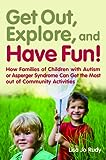

On her blog at [About.com:Autism](http://autism.about.com), Lisa Jo Rudy usually asks questions. In her soon to be released new book, [Get Out, Explore, and Have Fun!: How Families of Children With Autism or Asperger Syndrome Can Get the Most Out of Community Activities](http://www.amazon.com/gp/product/1849058091?ie=UTF8&tag=gbrettmiller-20&linkCode=as2&camp=1789&creative=9325&creativeASIN=1849058091), she answers two very important questions:

1. Why should you "get out, explore, and have fun" with your autistic child?
2. How do you do this?

By far the more important of these two questions (in my opinion) is the first, the "why". Too many parents of children diagnosed as autistic spend all of their "free" time trying to make their child "more normal" or "less autistic", and not enough time on letting their child be a kid. As Lisa explains, this is true even in - especially in - school.

Many IEPs are so focused on making kids normal that they deny kids the chance to be part of a normal environment. Lisa describes, for instance, how some schools will take autistic students on "life skills" field trips to a grocery store or McDonald's while their classmates take a trip to a museum or other entertaining - and educational - locale.

Life is for living, and in the first couple of chapters Lisa reminds us that this is as true for our autistic children as it is for our non-autistic children. The first two chapters of the book should be required reading for all parents of children who receive a diagnosis of autism, that's how important her message is in answering the "why" question. If autistic kids are never given a chance to experience life, how will we - or they - ever know what they want from life?

Lisa spends the bulk of the book exploring the "how" of getting out. As the parent of an 18 year old autistic son who has gotten out there, explored, and had fun, I can say that she has done an excellent job compiling not only lists of possible activities, but the good and potential bad of each as well as tips on how to make sure the experiences are valuable ones.

What I most appreciated in the "how" section is that she doesn't sugar coat anything. Far from being pessimistic about things, she is simply honest about what you are likely to experience. She also reminds us to be realistic in what we expect of our kids, and of those we interact with "out there". Even though the "why" applies equally to all kids, the challenges of the "how" will vary. Autism is, after all, a spectrum, and the experiences parents will have when they "get out" will cover a wide spectrum as well.

Only parents can appreciate the challenges they will face with their own kids in trying to get out there. My only suggestion here is that you lean toward stretching your boundaries, and your kid's, by trying something just a little bit harder than what you think you can do. You will find that this can be hard work, but you will also see that it is worth every ounce of sweat you put into it.

If you are the parent of a young - or not so young - autistic child, you should get and read this book. And give a copy to your child's teacher, their IEP case worker, the IEP team.

Life is for living, even for an autistic child, and this book reminds us why this is true and how to make it happen.
