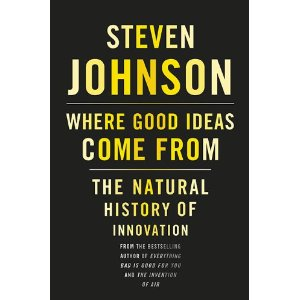

As a thank you for pre-ordering [Steven Johnson](http://www.stevenberlinjohnson.com)'s new book [Where Good Ideas Come From: The Natural History of Innovation](http://www.amazon.com/gp/product/1594487715?ie=UTF8&tag=gbrettmiller-20&linkCode=as2&camp=1789&creative=9325&creativeASIN=1594487715), I was invited to listen in on a special webinar where he spoke about the book and some of its ideas. Here are my (raw) notes from the webinar. Lots of good nuggets to be mined, lots of things to think and talk about.

\= = == === =====

Started off talking about how his book [Emergence: The Connected Lives of Ants, Brains, Cities, and Software](http://www.amazon.com/gp/product/0684868768?ie=UTF8&tag=gbrettmiller-20&linkCode=as2&camp=1789&creative=9325&creativeASIN=0684868768) came about. He was working on a book about brains, then received as birthday gift a book of old maps. He noticed that the map of Hamburg looks like cutaway of the human brain. What if it's not a book about cities or brains, but a book about cities AND brains? The hunch was there, but he had no idea what to make of it. Vague sense that there was something promising. Kept the hunch alive, explored the connections between the two. Several drafts where the connections weren't well formed, he finally came up with it after quite a bit of research.

The key thing is that he was able to keep the hunch alive and work through it.

We all have hunches like that, we think it might be promising but we don't know what to do with it. We need a way in our organizations for these hunches to be kept alive and cultivated.

For the past six years he has kept a "sparks file". A single Word document (now Google Doc, so he can access from anywhere), he puts every half-baked (or less) idea he has about a book or story in it. No organization, no sorting at all. If you spend too much time putting it in order - folders, etc - you will miss the connections. Reread it every couple of months. \[A lot like how I use my own notebooks, which reminds me it is time to go through them again.\] The document is 6 years old, some ideas have grown into books, some are not so interesting.

When you reread the document you come across a snippet that you had forgotten about, or that didn't make sense at the time, that now makes some sense. Allows you to network with your past ideas.

Do it with other people's ideas, too. Talked about the idea of the Commonplace Book from the Enlightenment. People would copy bits and pieces from influential works that they've read. "Commonplacing". Same function as your own sparks file, except it has other people's ideas and writing in it.

It is not enough to just take notes, you have to revisit them. Getting easier now with technology - Kindle, blogs, social bookmarks. Revisiting is important, so you can renew old thoughts and find new connections.

[DevonThink](http://www.devon-technologies.com/products/devonthink/) is the tool that he uses. I remember seeing him talking about this many years ago when I first read one of his books. Allows you to dump just about anything into it as an open database. Mac only still? \[Yes\] Looks at a snippet of text and finds other snippets that are related. It's smart, but not too smart. It is a bit fuzzy, and it is this noise that really helps make connections. "My outboard memory of all the things I've read." Sometimes, types in something that he wrote to see what it returns.

Who had the idea, me or the software? A little bit of both. It took him to curate the tidbits, the software to make the connections, and him to put together the final thought.

Bill Gates takes a "reading vacation" to read. Ray Ozzie does the same thing. A very interesting strategy; usually when we read it is at night, when we are tired and have 20-30 minutes before we go to bed. Takes a couple of weeks to read, you lose the possible connections between the books you read.

\[This is why 52 in 52 is so important, read in rapid succession. This explains why ideas come so fast and furious when I am reading a lot.\]

Could be a great value to companies to give their employees a week of reading vacation every year. Need to make sure that the suggested reading list has some diversity, and is not just focused in one new area.

Diversity of ideas is key to innovation. An idea from one area provides the insight that creates innovation in another. In nature this is called exaptation.

A look at the extended social networks of innovative people. Unusually innovative people have very diverse weak-tie networks; not just a lot of weak-ties, but very diverse weak-ties. An exceptionally powerful idea and tool.

Have to be open and fluent in those different fields, catholic in your tastes. \[I think this is the first time I have ever heard someone use "catholic" in this generic, non-church sense.\]

Discussed the importance of coffee shops as multi-disciplinary hubs in the 18th century, which he talked about in The Invention of Air. Social network software is helping serve this function. He uses Twitter as a way to get recommended reading items, his daily digest of things to read. Set up your social network life to follow a diverse group of people, you can get a very interesting reading list curated for you every morning. **A serendipity engine**.

Unusually innovative people have a lot of hobbies, always working on a bunch of different things. Used Darwin as an example; his side projects allowed him to create an "internal coffee house".

Where Good Ideas Come From is intended to provide an interdisciplinary look at things.

Questions from the audience:

Public education - positive, negative, neutral? Historically, it has not been an environment particularly open to innovation. But I think we are at an inflection point where we can rething how things should work. A lot of innovation happening in that area right now. Let's not break it into different subjects, but use topics to include all of the subjects. Games and simulations, as he mentioned in [Everything Bad is Good for You](http://www.amazon.com/gp/product/1594481946?ie=UTF8&tag=gbrettmiller-20&linkCode=as2&camp=1789&creative=9325&creativeASIN=1594481946), also have a lot of promise.

How will innovation change because of the internet, and being so spread out? The web is a huge innovation hub. Exploring the idea of a social commonplace book. \[I have to wonder how this is different from social bookmarking?\]

How do small organizations cultivate hunch-making? By definition, a startup is kind of experimental anyway, so you don't really have to cultivate the hunches. In some ways, it's 100% hunch. Along these lines, he mentioned the growing idea of coworking:

> One of the most interesting things that has developed recently is coworking spaces. Small startups, freelancers, people between jobs, or people that just don't want to go into the main office. It gives you infrastructure, gives you other people. A "liquid network" that I talk about in the book. Interesting related ideas but not too much structure. For a young business to share a physical space with another young business, that's a great opportunity.

\===== === == = =
