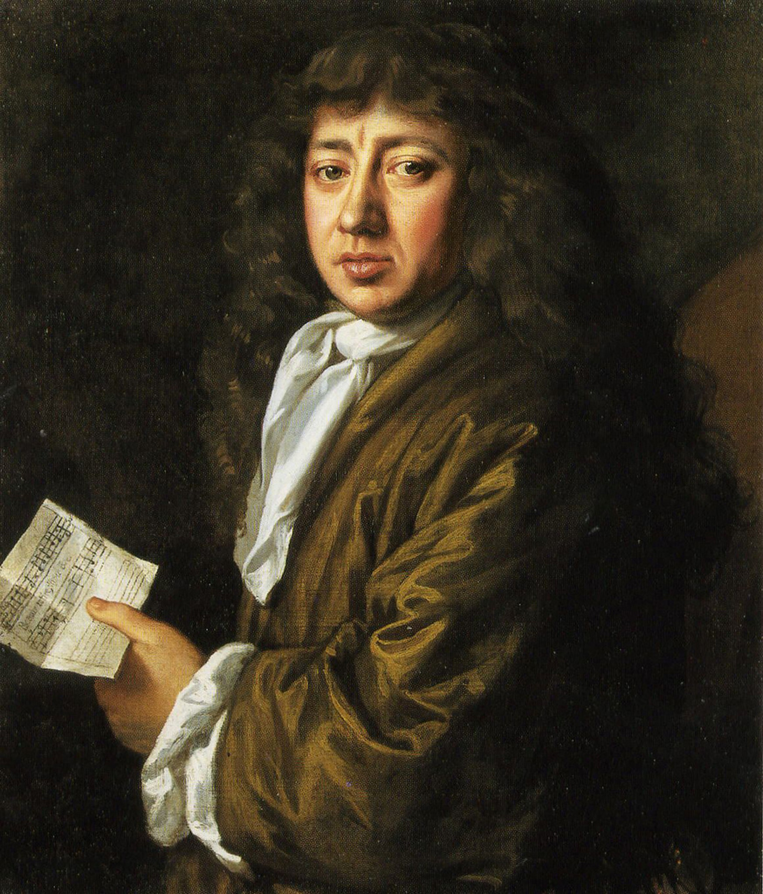

Much of what we know about the events of history comes from the personal writings - journals, diaries, letters - of the people that lived those events. Reading these diaries is simple enough - assuming they are in a language you can read - but understanding them in their original context can be a bit daunting. That's why we have historians to help us make sense.

An excellent example comes in the form of the diaries of Samuel Pepys. Written over nearly 10 years beginning on the first day of 1660, Pepys' diaries give an incredible insight into life and politics in London during this exciting period in history. If, that is, you understand what it is he is talking about.

Enter [Phil Gyford](http://www.gyford.com/) and [The Diary of Samuel Pepys](http://www.pepysdiary.com/). In addition to turning the diary into a blog (the first entry was published on 1 Jan 2003), Phil has provided extensive contextual detail about people, places, and events to help readers better understand the significance of individual entries and - perhaps more importantly - be able to follow the story line.

If you are even remotely interested in what was going on in London in the 1660's, this is one site you don't want to miss.

It's hard not to wonder how these diaries might have been different had they been written as a blog, or if he had Twitter to post his thoughts. (I've asked this question before, about [Benjamin Franklin](http://blog.gbrettmiller.com/the-blogs-of-benjamin-franklin/) and [Leonardo da Vinci](http://nsl.gbrettmiller.com/2007/the-blogs-of-leonardo-da-vinci)). More interestingly, would we think about our history differently if we were reading of it in blogs and tweets instead of personal - and often private - journals and diaries?

Much of what future historians will know of us will come from our online writings. Will they get an accurate picture of our lives? Are we, and future generations, losing something by having so much out there for everyone to see? Or will future generations have a better understanding of why the world is as it is because of all this openness and discussion?

_(photo: painting of Samuel Pepys by John Hayls, 1666)_
