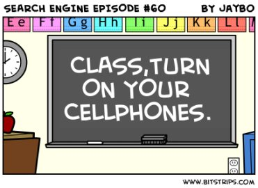

Towards the back of his book [Don't Bother Me Mom, I'm Learning](http://astore.amazon.com/gbrettmiller-20/detail/1557788588/105-0704870-6814832), published in 2005, author [Marc Prensky](http://www.marcprensky.com/) discusses the potential for using cell phones as a tool for learning in schools. I read the book back in the fall of 2006, and though I agreed with much of what he wrote in the book, I just did not see the potential for cell phones that he did. A huge **failure of imagination** on my part.

In my Google Reader feeds recently was an item shared by [Harold](http://www.jarche.com/) [Jarche](http://www.google.com/reader/shared/hjarche) ([@hjarche](http://twitter.com/hjarche)), an interview with Royan Lee - "a teacher who's not afraid of technology" - entitled [Class, turn on your cellphones](http://www.tvo.org/cfmx/tvoorg/searchengine/index.cfm?page_id=613&action=blog&subaction=viewPost&post_id=13513&blog_id=485).

Interviewer Jesse Brown introduces the topic with the following:

> **One of the only places where it is still totally unacceptable to instantly learn about anything with a mobile device is in school.**

Like so many things that bring about drastic change, the biggest concern that most parents and teachers (and administrators and school board members) have regarding mobile devices in the classroom is a fear of the unknown. They don't understand it, so it must be bad, it is something to be afraid of and avoided.

If you are a parent or a teacher  (or administrator or school board member) who thinks that mobile devices have no place in school, then you really need to listen to this interview. It may not change your mind, but at least you'll have a better understanding of what it is you are preventing.

Mr. Lee also takes on what he sees as a huge myth that needs to be overcome, that because students use this stuff so much they actually know how to use it. (See my post [Social savvy, yes - tech savvy, not so much](http://blog.gbrettmiller.com/social-savvy-yes-tech-savvy-not-so-much/) for some more thoughts on that.) Starting at 10:25 -

> One big myth that we have is that because students are using Facebook on their own that somehow savvy already in terms of using these devices and their digital literacy.... It never ceases to amaze me how untrue this is. It's almost frightening, especially the older kids who've been using it for a while. In many cases they've built up some really bad habits in terms of online behavior and posting behavior.
