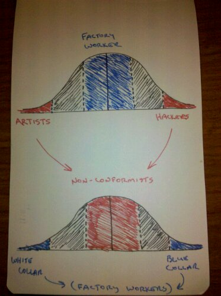

Back in April I wrote a post titled [Different is the new normal](http://blog.gbrettmiller.com/different-is-the-new-normal/). In that article I looked at "normal" and "different" in the cultural sense; this is the primary context in which most people put this discussion. It occurred to me a week or so ago, though, that it would be interesting to see what this would look like from a mathematical perspective.

The first thing I think of when I hear "normal" is the [normal distribution curve](http://en.wikipedia.org/wiki/Normal_distribution). So I thought, what if we put normal in the middle, and different on the ends to represent the current (and hopefully fading) view. And then, to represent different as the new normal, switch it up and put different in the middle and normal on the ends. So I started sketching out the diagrams to the right.

I played around with it a bit, mostly trying to figure out how to label the diagram. Using "normal" and "different" just didn't seem right. I really like Seth Godin's description of today's normal as "factory work", so I adopted that as "normal". To split it into the ends, it made sense (to me, anyway) to label them as "blue collar" and "white collar". Factory work is factory work, after all.

Labeling "different" was a bit more of a challenge. Though I like Seth's idea of linchpins, it just didn't seem to fit in this context. I did know that I wanted to use "artist", as Seth describes them, as one end of different. Then I read [Hacking Work](http://www.amazon.com/gp/product/159184357X?ie=UTF8&tag=gbrettmiller-20&linkCode=as2&camp=1789&creative=390957&creativeASIN=159184357X) and "hacker" became the obvious choice for the other end of different. But I was still stuck on how to describe "different". Until, that is, I read [The Art of Non-Conformity](http://www.amazon.com/gp/product/0399536108?ie=UTF8&tag=gbrettmiller-20&linkCode=as2&camp=1789&creative=390957&creativeASIN=0399536108) today.

Then it was obvious.
